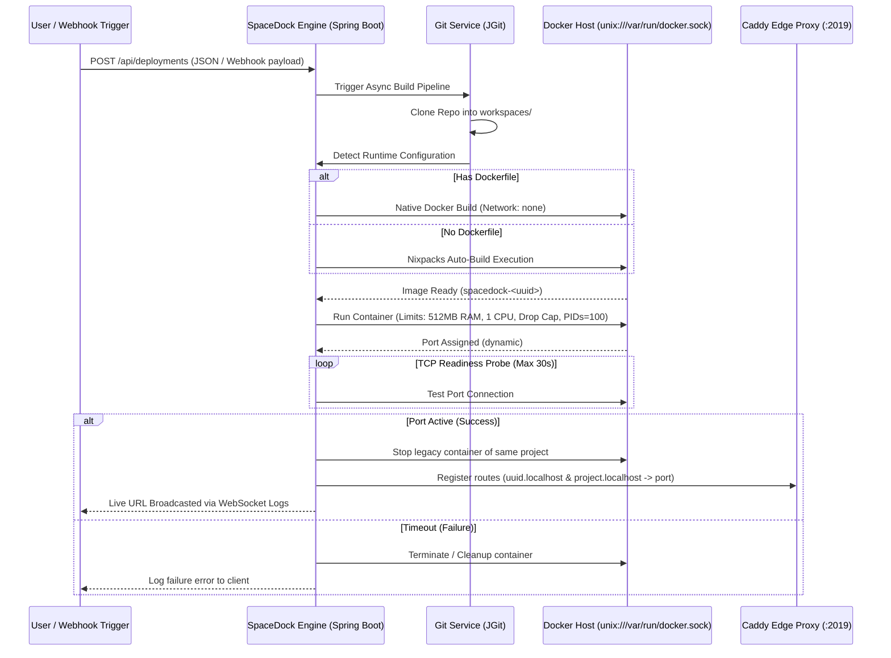

# SpaceDock | Self-Hosted Git-to-Docker PaaS Engine

SpaceDock is a lightweight, cloud-native Platform-as-a-Service (PaaS) engine built with Spring Boot 3 and Docker Java. It automates the Developer Experience (DX) by monitoring source code repositories, extracting application runtime targets, managing persistent environment configurations, and handling dynamic multi-tenant proxy routing with zero down-time.

---

## 🏗️ System Architecture

- **The Brain (Orchestration Layer):** Built on Spring Boot's asynchronous processing engine (`GitService`), it manages the full automation lifecycle: Clone ➡️ Detect ➡️ Build ➡️ Active Verification ➡️ Network Swap.
- **The Engine (Infrastructure Layer):** Communicates natively with the Unix Docker socket using the `docker-java` client API wrapper to govern sandboxed container runtime lifecycles.
- **The Routing Gatekeeper (Proxy Layer):** Orchestrates dynamic edge route bindings on-the-fly using Caddy Server's programmatic loop administration port (`:2019`).



---

## 🛡️ Production-Grade Hardening & Security Architecture

Rather than relying on raw execution paths, SpaceDock is hardened to resist multi-tenant infrastructure vulnerabilities:

### 1. Server-Side Request Forgery (SSRF) Mitigations
To prevent malicious code repositories from probing private internal cloud topologies, the engine intercepts inbound repository configurations. It blocks loopback paths, non-standard schemes, and private IP subnets (`127.0.0.1`, `10.0.0.0/8`, `172.16.0.0/12`, `192.168.0.0/16`) at the controller boundary.

### 2. Container Isolation & Resource Limiting
To defend against resource exhaustion attacks (such as fork bombs or memory leaks) and escalation risks, every deployed application runtime is aggressively throttled and unprivileged:
- **Capability Elimination:** Complete removal of elevated execution rights (`--cap-drop=ALL`).
- **Privilege Block:** Explicit configuration preventing process tree elevation (`no-new-privileges`).
- **Thread Constraints:** Process IDs are restricted (`pidsLimit = 100`) to halt resource exhaustion.
- **Resource Hard Caps:** Strict memory allocation boundaries (512MB) and CPU consumption ceilings (1.0 Core).

### 3. Encrypted Secrets Management (AES-256-GCM)
Environment configurations are fully decoupled using a persistent Project data model profile layer. Environment data payloads are encrypted at rest inside a PostgreSQL database using authenticated **AES-256-GCM** cryptography. Each string initialization uses a cryptographically secure random 12-byte initialization vector (IV) to prevent cryptographic pattern matching. Decryption occurs strictly in-memory right before container instantiation.

### 4. Active Fault-Tolerant Routing (Readiness Probes)
To eliminate `502 Bad Gateway` glitches during compilation, SpaceDock uses a non-blocking active TCP socket readiness loop. Caddy edge proxy routing endpoints are updated only after the application container passes network validation, ensuring smooth version updates without traffic drops.

### 5. Zombie Process Reaper Coordination
A background task reclaims resources from failed instances by matching database runtime declarations with live engine containers every 60 seconds, preventing orphaned background workloads from accumulating.

---

## 🚀 Tech Stack

- **Backend Core Framework:** Java 21, Spring Boot 3.2.3, Spring Security, Spring Data JPA
- **Database Management System:** PostgreSQL 15 (Alpine)
- **Container Abstraction Core:** Docker Engine API via `docker-java`
- **Reverse Proxy Infrastructure:** Caddy Server (programmed via HTTP JSON API config)
- **Source Code Processing Engines:** Eclipse JGit & Nixpacks automated container generation
- **Frontend Client Layer:** Vanilla ES6 Javascript (Decoupled Service-View Architecture Module) with STOMP/SockJS protocol handling

---

## ⚙️ Getting Started

### Prerequisites

Ensure you have the following installed on your host system:
* **Java Development Kit (JDK) 21**
* **Docker Engine & Compose**
* **Nixpacks** (Global CLI utility, required for zero-config build detection)
  ```bash
  curl -sSL https://nixpacks.com/install.sh | bash
  ```

### 1. Configuration (`.env`)

Create a `.env` file in the root directory (based on the `.env` template):

```ini
DB_USERNAME=admin
DB_PASSWORD=adminpassword
SPACEDOCK_API_KEY=your_super_secret_api_key
SPACEDOCK_WEBHOOK_SECRET=your_super_secret_webhook_secret
SPACEDOCK_ENCRYPTION_KEY=your_super_secret_encryption_key_123
SPACEDOCK_ALLOWED_ORIGIN=http://127.0.0.1:5500,http://localhost:5500,http://127.0.0.1:8082,http://localhost:8082
```

> [!NOTE]
> Environment variables loaded from `.env` are dynamically imported at runtime via Spring Boot's config-import feature.

### 2. Infrastructure Setup

Launch the database and edge proxy using Docker Compose:

```bash
docker compose up -d
```

This starts:
* **PostgreSQL:** Running on port `5432`
* **Caddy Server:** Configured with its administrative JSON API exposed on `127.0.0.1:2019` and routing listening on port `80`.

### 3. Run the Backend Application

Compile and launch the Spring Boot engine:

```bash
./mvnw spring-boot:run
```

The server will spin up on port `8082`.

### 4. Running the Frontend

The frontend is a static web client located in the `/frontend` directory. You can host it using any static file server, for example:

```bash
# Using Python's built-in HTTP server
cd frontend
python3 -m http.server 5500
```

Open `http://localhost:5500` in your browser. Be sure to paste your `SPACEDOCK_API_KEY` into the dashboard credentials configuration field to authenticate dashboard operations.

---

## 🔌 API & Webhook Reference

All endpoints except public webhooks require authentication via the `X-API-Key` HTTP header.

### Endpoints Summary

| Method | Endpoint | Auth | Request / Payload Details | Description |
| :--- | :--- | :--- | :--- | :--- |
| **`POST`** | `/api/deployments` | `X-API-Key` | `{ "repoUrl": "...", "envVars": { ... } }` | Enqueues a deployment pipeline task. |
| **`GET`** | `/api/deployments` | `X-API-Key` | *None* | Retrieves all history and active deployments metadata. |
| **`GET`** | `/api/deployments/{id}` | `X-API-Key` | Path Parameter: `id` (UUID) | Fetches details and status of a specific deployment task. |
| **`DELETE`** | `/api/deployments/{id}` | `X-API-Key` | Path Parameter: `id` (UUID) | Terminates running containers and strips active Caddy routing. |
| **`POST`** | `/api/webhooks/github` | Signature Check | GitHub Push Event Payload | Triggers automated pipeline updates. |

### Webhook Authentication

For GitHub webhooks, SpaceDock verifies payloads natively:
1. Provide the backend path: `http://<your-ip-or-domain>:8082/api/webhooks/github`.
2. Provide the secret defined in `SPACEDOCK_WEBHOOK_SECRET`.
3. SpaceDock computes `HMAC-SHA256` signatures using the webhook secret, cross-checking the `X-Hub-Signature-256` header in constant-time to block timing side-channel attacks.

---

## 📡 WebSockets Log Streaming

SpaceDock broadcasts real-time pipeline compile and run logs over WebSockets.

* **Connection Endpoint:** `ws://localhost:8082/ws` (SockJS fallback enabled)
* **STOMP Protocol Topic:** `/topic/logs/{deploymentId}`

Client logs are categorized via indicators prepended by the engine:
* `❌` / `error` / `failed`: Error lines (red highlight in dashboard).
* `✅` / `🌍` / `success`: Pipeline status successes (green highlight).
* `📡` / `🐳` / `🧹`: System events and cleanup actions (blue highlight).
